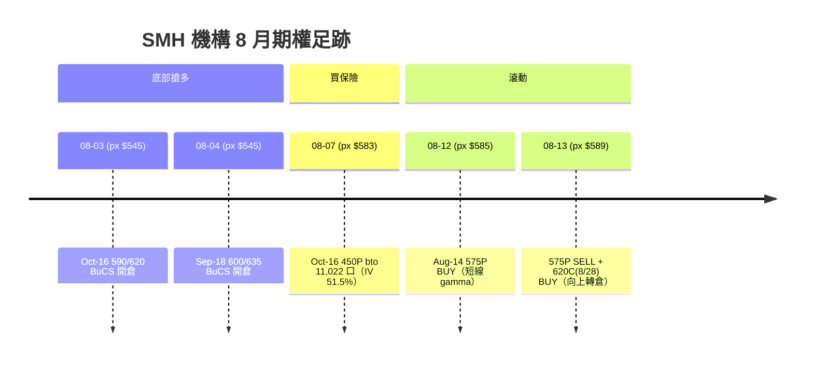

# SMH（TREND2 + TREND）深度機構分析 — 2026-08-16

**分析時點**：2026-08-16 20:38 TPE（週六，市場休市）
**最新 confirmed 收盤**：SMH **$587.82**（2026-08-14 週五收盤）
**資料截止**：SG data_table as-of **08-11**｜synth_oi/history_v4 as-of **08-13**｜FP 最新 session **08-13**
**前卡承接**：本分析為跨週複盤總覽，承接 [[15-08-2026_SMH_strategy]]（跨日更新）← [[13-08-2026_SMH_strategy]]（TREND2+TREND 全跑）← [[13-08-2026_SMH_tracking]]（SSOT 每日回標入口）

---

## 縮寫對照

| 縮寫 | 全稱 |
|:---|:---|
| PW / CW / HW | Put Wall / Call Wall / Hedge Wall |
| KG / KD | Key Gamma Strike / Key Delta Strike |
| SkR | Skew Rank（高＝call 相對 put 變貴） |
| IVR / GarchR | IV Rank / Garch Rank |
| DR / GR | Delta Ratio / Gamma Ratio |
| GN / GEX | Gamma Notional / Gamma Exposure |
| PC OI | Put/Call Open Interest Ratio |
| FP | FlowPatrol（SG 機構大單流） |
| BuCS / BePS | Bull Call Spread / Bear Put Spread |
| VRP | Variance Risk Premium（IV − RV） |
| OPEX | Options Expiration |
| BE | Break-even |
| NAV | Net Asset Value |
| rr4b | sector_hedge_pct（板塊避險比率） |

---

## 一、總覽 TL;DR

> **SMH $587.82 在 $580 PW 與 $600 CW 之間夾擊，Pin 強度極高（PW 82/100、CW 66/100）。上方唯一解鎖鍵是 NVDA 8/26 財報。機構 8 月全面轉多但載體全是封頂 spread + 遠月崩盤險——沒有裸買 call。我方兩張深水 call（SMH Jan'27 580C ×2、SOXX Nov'26 570C ×3）方向對但 BE 偏高（+18.8% / +22.1%），板塊避險 rr4b = 0.00%。等 $600 表態的局面 3 天來不僅沒改變，反而更明確。**

---

## 二、TREND2 跨日結構（07-01 → 08-14，完整週期）

### 2.1 五階段演進

| 階段 | 期間 | 價格 | ROMA 評分 | PC OI | IVR | **SkR** |
|:---|:---|:---|:---|:---|:---|:---|
| ① 初跌 | 07/01–07/03 | 656→592 | −11→−8 🩸 | 3.2–3.3 | 1.00 | 0.25–0.37 |
| ② 反彈失敗 | 07/06–07/20 | 592→612→557 | −6→+5→+2 | 2.5–2.9 | 0.87–1.00 | 0.22–0.28 |
| ③ 二次探底 | 07/22–07/30 | 558→**504**（低點） | −8 🩸 連五日 | **3.10–3.23（峰值）** | 0.93–0.98 | 0.24–0.60 |
| ④ V 型修復 | 08/01–08/07 | 538→583 | −2→+7→0 | **2.41→1.93（腰斬）** | 0.81→0.57 | **0.92–0.97** |
| ⑤ 高位整理 | 08/10–08/14 | 569→**587.82** | +5→**+4（轉弱）** | 1.90–1.91 穩 | **0.43→0.38（新低）** | **0.94→0.98（新高）** |

### 2.2 牆位遷移表（data_table SSOT）

```
        KG    KD    HW    CW    PW    解讀
07/15   600   400   605   650   550   箱體 550–650
07/20   550   700   590   700   550   下殺 CW 虛化
07/30   520   700   560   650   500   ← 底部
08/02   550   700   560   600   500   CW 從 650 收斂到 600
08/06   600   600   570   600   500   KG/CW 合流 600
08/12   600   400   570   600   500   維持（data_table 凍結）
⚠️08-16 scan 讀到 PW $580（V4）vs synth LVP $415，分歧 28.4% — 已觸發降權
```

### 2.3 跨日核心判定

1. **「07-31 保護到期消滅」精確成立**：PC OI 從 ③ 峰值 3.10–3.23 在 3 個交易日內崩到 1.81（−42%），是到期消滅不是漸進漂移。**至今未回補**（現值 1.91）。
2. **價格修復遠快於結構修復**：+17.5% off low 504 → 588，但 PW 遠在 500–580（取決於口徑），$500–$570 為 gamma 真空帶。
3. **IV Rank 是唯一單調序列**：0.84 → 1.00 → 0.43 → **0.38**（全期新低），持續單向冷卻，機構避險需求整體降溫的最乾淨佐證。
4. **SkR 持續攀高到極端位**：0.22–0.28（③恐慌頂）→ **0.984**（⑤最新）。正確讀法：保護的**相對**價格是一年來最便宜，但**絕對上仍 put-skewed**（Sep-18 520P IV 42.1% > 650C IV 38.8%）。裸買 call 站在擁擠側。

### 2.4 ROMA scan 最新（08-16，結構日 08-13）

| 指標 | 數值 | 前值（08-12） | Δ |
|:---|---:|---:|:---|
| 收盤價 | 588.75 | 584.83 | +0.67% |
| PW / CW（V4） | **580 / 600** | 500 / 600 | ⚠️ PW 上移 |
| DR | 0.713 | 0.435 | +64% |
| GR | 0.428 | 0.682 | −37% |
| ATM GN | **−118M$** | −7M$ | 負向擴大 16x |
| 評分 | +4/22 | +9/22 | 動能轉弱 |
| ADX | **15.92** | — | ＜20 區間環境 |
| SkR | **0.984** | 0.936 | 更極端 |
| IVR | 0.378 | 0.43 | 繼續探底 |

> **重要變化**：PW 從 $500 跳到 $580，但 synth LVP 仍在 $415，**分歧 28.4%** — 系統已觸發雙止損、D9/D10 降權。GN 負向爆擴（−7M → −118M$），dealer 對沖壓力飆升，但 DR 同步大升（+64%）— 多空信號矛盾，評分自 +9 降至 +4。

---

## 三、TREND 機構流量分析（FP 逐筆，08-03 → 08-14）

### 3.1 機構部位演進表



### 3.2 逐筆 FP 解讀

| Session Date | 部位 | 判讀 |
|:---|:---|:---|
| **08-03** | Oct-16 590/620 BuCS（v$+357k/−339k） | 🟢 首次轉多，低位建倉，蓋住 NVDA+TSM 財報 |
| **08-04** | Sep-18 600/635 BuCS（v$+293k/−272k） | 🟢 加碼，天期蓋住 NVDA 8/26 |
| **08-07** | Oct-16 450P bto 11,022（IV 51.5%, OI 12,034） | 🔴 遠月崩盤險（距現價 −24%），**多頭但有保單** |
| 08-12 | Aug-14 575P BUY g$24.72M | ⬜ 到期前一日 gamma 操作，非結構 |
| 08-13 | 575P SELL + 620C(8/28) BUY（同 spread ID 7830） | 🟢 平掉短腿 Put、買 620C，向上 Diagonal Roll |

### 3.3 yfinance OI 交叉驗證（as-of 08-14 結算）

| 部位 | OI | 狀態 |
|:---|---:|:---|
| Sep-18 600C / 635C | 16,431 / 4,630 | ✅ 在（600C 含裸多 call） |
| Oct-16 590C / 620C | 3,827 / 4,507 | ✅ 在 |
| **Oct-16 450P** | **11,640** | ✅ 全數留倉 |
| Oct-16 500P | 6,540 | ✅ 第二層尾部 |
| **Aug-21 600C** | **16,217**（TopG，OPEX pin） | ✅ 最大 pin |
| Jan-15'27 700C | 7,152 | ✅ 持續加碼 |

### 3.4 機構行為特徵圖譜

> [!IMPORTANT]
> **機構載體全是「封頂多頭 + 尾部保單」的啞鈴結構，無任何一筆裸買 call。**
> - 多頭表達 ＝ BuCS（Sep 600/635、Oct 590/620），天花板在 **$620–635**
> - 保險 ＝ Oct-16 450P（11,640 口）+ 500P（6,540 口），覆蓋 NVDA + AVGO + TSM 三大財報
> - 新增 ＝ 08-13 的 620C(8/28) BUY，**短天期追蹤倉**而非長期結構

---

## 四、催化劑時間軸 ＋ 事件錨

| 事件 | 日期 | 與期權結構的關係 |
|:---|:---|:---|
| VIX OPEX | **08-19（週二）** | SG 稱計畫加碼 VIX call |
| **Aug-21 OPEX** | **08-21（週四）** | 600C OI 16,217 = 最大 pin → 財報前到期 |
| **NVDA 財報** | **08-26（週二）** | 板塊唯一解鎖鍵；Sep-18 BuCS 天期覆蓋 |
| Jackson Hole | **08-27–29** | SG 定調「重度避險事件」 |
| AVGO 財報 | **09-03** | Sep-18 覆蓋 |
| TSM 財報 | **10-15** | Oct-16 到期前一日（崩盤險覆蓋） |

> [!WARNING]
> **8/21 OPEX 後緊接 NVDA 財報 + Jackson Hole — 短天期 IV 極便宜（QQQ IV < RV），SG 預期 OPEX 後 vol 回升**。VRP −9.4pt（IV 37.8% vs RV 47.2%）目前偏買方，但 1M RV 含 7 月崩盤分母，滾出後會自然衰減。

---

## 五、宏觀敘事（大行觀點匯整）

| 機構 | 觀點 | 含義 |
|:---|:---|:---|
| **MS（Mike Wilson, 08-03）** | 半導體為 7 月動能清算震央；類比支撐→可交易反彈，但**今年恐難重奪領導權**；早週期→中週期，Hyperscalers 優於 Semis | 🟡 戰術多頭，非結構 |
| **JPM（08-06）** | AI 驅動 DRAM 多年供需吃緊，Token 每瓦成本年降 ~90%，產能排擠效應 | 🟢 硬體需求不鬆 |
| **GS（08-07）** | 全球 AI Capex 破 $1T，半導體設備進口指標頂部運行 | 🟢 上游投資全速 |
| **MS（08-07）** | AI Overwatch Act / MATCH Act → 出口管制擴大至設備，政策阻力 | 🟡 監管逆風 |
| **SG Weekly（08-09）** | SMH/QQQ/SPY RR Rank 均 >95%，極端 Call 擁擠 | 🔴 追高擁擠 |

**匯整**：基本面穩（Capex 全速、DRAM 供需吃緊），但市場風格從早週期半導體轉向中週期品質股，且情緒指標（SkR/RR Rank）處極端擁擠位。

---

## 六、我方持倉診斷（SSOT: brokerage_log 14-08-2026）

| 部位 | 數量 | MV | UPL | BE | 距現價 | DTE |
|:---|---:|---:|---:|---:|---:|---:|
| SMH Jan15'27 580C | 2 | $13,739 | **−$11,110** | $704.16 | +19.8% | 155 |
| SOXX Nov20'26 570C | 3 | $13,379 | **−$19,400** | $679.24 | — | 99 |

- **半導體合計 MV $27,118 = NAV ~4.2%**；Δ 曝險 $150k（+23.3% NAV）
- **rr4b 板塊避險比 = 0.00%**（無任何 SMH/SOXX long put 或 BePS）
- **rr3 gross leverage = 2.25x**（警示區）
- **SMH Δ=+0.59 ITM +1.2%**（B4 已觸發）
- **SOXX Δ=+0.50 OTM −3.6%**

> [!CAUTION]
> **載體問題**：方向對了，但 BE 在 $704（+19.8%）/ $679（SOXX），遠超機構天花板 $620–635。裸長 call 買在 SkR 擁擠側 + 高權利金 → 價格修復 +17.5% 而持倉仍深水。這是**載體診斷，不是方向否定**。

---

## 七、S1–S6 觸發表（承接 13-08 卡，逐項更新）

| # | 觸發條件 | 13-08 卡 | 15-08 更新 | **08-16 最新** | 狀態 |
|:---|:---|---:|---:|---:|:---:|
| S1 | 站上 $600 連 2 日收上 | 距 −1.24% | 距 −2.03% | **距 −2.07%** | ☐ 更遠 |
| S2 | 跌破 HW $570 收下 | 距 +3.96% | 距 +3.1% | 距 +3.1%（HW 未重查） | ☐ |
| S3 | 跌破 PW $500 | 距 −15.6% | 距 −14.9% | 距 −14.9% | ☐ |
| S4 | Sep-18 635C OI ≥8,000 | 4,630 | 未重查 | 未重查 | ☐ |
| S5 | Oct-16 450P/500P OI 塌陷 >30% | 11,640/6,540 | 未重查 | 未重查 | ☐ |
| S6 | SkR 跌回 <0.60 | 0.936 | 0.984 | **0.984（不動）** | ☐ 極端 |

**B 系列觸發**：B2（Put Delta >300M）已於 08-15 確認觸發（344.6M→358.9M），但 B1（收盤 ≥600）、B3（特定 OI 續增）仍未同步 → 「單一欄位回補」vs「結構性反轉」待下週驗證。

---

## 八、水位總表

| 層級 | 價位 | 來源 | 距現價 |
|:---|---:|:---|---:|
| Sep-18 機構天花板 | **$635** | FP 08-04 BuCS 空腳 | +8.0% |
| Oct-16 機構天花板 | **$620** | FP 08-03 BuCS 空腳 | +5.5% |
| **CW ＝ KG ＝ Aug-21 最大 OI** | **$600** | data_table + OI 16,217 | **+2.1%** |
| **現價** | **$587.82** | 08-14 收盤 | — |
| **PW（V4 最新）** | **$580** | 08-16 scan | −1.3% |
| HW | **$570** | data_table（as-of 08-11） | −3.0% |
| ← **gamma 真空帶** → | $500–$570 | 無結構支撐 | |
| 機構第二層保單 | **$500** | Oct 500P OI 6,540 | −14.9% |
| 機構尾部保單 | **$450** | Oct 450P OI 11,640 | −23.4% |

---

## 九、GEX 制度與 Pin 分析（08-16 scan）

- **制度**：🟠 **中負 Gamma**（−$118M ATM），dealer 追漲殺跌
- **翻正臨界**：需突破 CW **$600**（距 −1.91%），gamma squeeze 潛在
- **Pin 強度**：

```
  #1 Put Wall $580 — 82/100（距 -1.5%，極近）
  #2 Call Wall $600 — 66/100（距 +1.9%）
  → 🎯 強 pin 主導，被夾在 580-600 之間高機率
```

- **MAGNET 二態**：負 gamma + CW 上方 +1.9% → 潛在磁吸 $600，但需 rally flow 確認

---

## 十、綜合判讀與可執行選項

### ✅ 維持不變的結論

1. **$600 是唯一的二元判定**（S1）— 站上連 2 日收盤才談加碼，否則回頭看 HW $570 / PW $500
2. **機構做多但封頂在 $620–635**，無人裸買 call → **裸長 call 站在擁擠側**
3. **保護到期不補（主張 A）仍成立**：PC OI 1.91 距回補門檻（>2.5）仍有 32% 空間
4. **rr4b = 0.00%** 板塊完全無避險（刻意，但風險暴露事實存在）

### 🆕 本次新增 / 強化的觀察

| # | 觀察 | 含義 |
|:---|:---|:---|
| 1 | **PW 從 $500 跳到 $580（V4）**，但 synth LVP 在 $415（分歧 28.4%） | 壁位可信度下降，不可單獨倚賴 PW 做止損 |
| 2 | **GN 從 −7M 暴擴到 −118M$** | Dealer 對沖壓力飆升，負 gamma 加深 → 價格 pin 或劇烈波動 |
| 3 | **B2 已觸發**（Put Delta >300M 連 2 session） | 唯一已觸發的 B 系列，但 B1/B3 仍靜止 → 獨立訊號或前緣？ |
| 4 | **08-13 FP 620C(8/28) BUY** | 機構短天期追蹤倉指向 $620，呼應 BuCS 上緣 |
| 5 | **ROMA 評分 +9→+4 動能轉弱** | 配合 GN 暴擴，非雜訊 |

### 🎯 可執行選項（非建議，需 user 裁決）

| 選項 | 動作 | 理由 | 風險 |
|:---|:---|:---|:---|
| A. **等 $600 表態** | 不動 | S1 未觸發，局面不變 | 如果 NVDA 財報前 pin 在 580–600 不突破，DTE 繼續消耗 |
| B. **補板塊保護** | SMH Sep-18 560P/500P BePS（7-9 口，NAV 2%） | SkR 0.984 = put 相對便宜的一年高點；NVDA 8/26 + JH 8/27-29 雙催化劑 | 若反彈站穩 600 → 保險錢白花 |
| C. **降低 BE（封頂 spread）** | SMH Jan'27 賣 700C（OI 7,152, IV 41.8%） | BE 從 $704→~$675；機構天花板在 620-635，700 代價小 | 封頂長期上行空間 |
| D. **OPEX 後看 vol 回升** | 等 08-21 OPEX 過後再評估 | SG 預期 OPEX 後 vol 回升；IV 目前便宜（VRP −9.4pt） | 錯過 NVDA 前最後佈局窗口 |

---

## 十一、下週（08-17 → 08-22）回標 Checklist

- ☐ 週一開盤確認 data_table 是否更新至 08-14（已落後 3 個 session）
- ☐ S1：是否站上 $600（若站上，立即查 GEX 是否翻正）
- ☐ S2：是否跌破 HW $570
- ☐ B2：Put Delta 是否連 3+ session 維持 >300M（判定「結構回補」vs「單一欄位噪音」）
- ☐ B3：Oct-16 590/620 / Sep-18 600/635 OI 是否有變化
- ☐ 08-21 OPEX 後：600C OI 16,217 到期消失 → CW 是否上移？
- ☐ NVDA 財報（08-26）前避險結構是否回補

---

## [[關聯]]

[[15-08-2026_SMH_strategy]] · [[13-08-2026_SMH_strategy]] · [[13-08-2026_SMH_tracking]] · [[15-08-2026_BEPS-HEDGE_QQQ-SMH_strategy]] · [[11-08-2026_SMH-QQQ_解除避險結構_tracking]] · [[09-08-2026_sg_weekly]] · [[02-08-2026_sg_weekly]]
