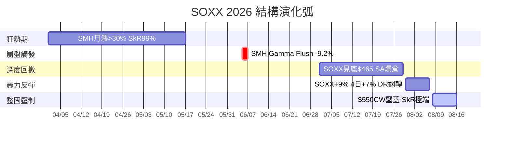
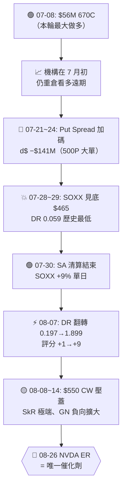

# SOXX TREND2 + TREND｜半導體 ETF 機構全景圖

> 🕐 **產出時點**：2026-08-16 20:38 TPE（週六），美股最後場次 **08-14（五）收盤**
> **現價**：SOXX **$550.42–$550.65**（多源交叉：WebSearch $550.42 / SG history_v4 $550.65 / brokerage S=$549.55）｜SMH **$587.82**
> **資料口徑**：內部 7 大目錄全掃 ＋ SG auto 全庫 ＋ FP 跨期 ＋ 外部 WebSearch
> **關聯卡**：[[13-08-2026_SOXX_strategy]]（本分析的核心前卡）｜[[15-08-2026_SMH_strategy]]（姊妹）｜[[15-08-2026_BEPS-HEDGE_QQQ-SMH_strategy]]（避險架構）

---

## 縮寫全稱對照

| 縮寫 | 全稱 |
|:---|:---|
| PW / CW / HW / KG | Put Wall / Call Wall / Hedge Wall / Key Gamma Strike |
| LVP / HVP | Low Vol Point / High Vol Point（synth_oi 口徑） |
| DR / GR | Delta Ratio / Gamma Ratio |
| IVR / SkR / GarchR | IV Rank / Skew Rank（**高＝call 貴，put 便宜**）/ Garch Rank |
| GEX / GN | Gamma Exposure / Gamma Notional（ATM 切片） |
| DPI | Dark Pool Indicator（bullish ≥60 / bearish ≤30） |
| RR / RR Rank | Risk Reversal / Risk Reversal Rank（call vs put 偏斜百分位） |
| VRP | Vol Risk Premium（IV − RV，負＝買方有利） |
| BePS / BuCS | Bear Put Spread / Bull Call Spread |
| FP | FlowPatrol（SG 機構大單追蹤） |
| SA | Situational Awareness（7 月底爆倉對沖基金） |
| COR1M | Cboe 1-Month Implied Correlation Index |
| NAV / rr3 / rr4b | 淨資產 / 總槓桿 / 板塊避險比 |
| OPEX | 月選到期日（本輪 2026-08-21） |

---

## 一、TREND2 — 跨日結構框架（4 月→8 月中旬完整弧線）

### 1.1 五段敘事弧

| 階段 | 時間 | SOXX 價格軌跡 | 核心事件 | 機構行為特徵 |
|:---|:---|:---|:---|:---|
| **① 狂熱** | 4–5月 | $378→$655 (+73%) | SMH 1Y +168%，SkR 99%，COR1M <8 | 追價：SOXX 390C $120M d$、SMH 500P $15M 避險 |
| **② 崩盤** | 6/5–6/7 | $655→$567 (−13.4%) | SMH Gamma Flush −9.2%（2020 來最大日跌） | 跌破 610 正 Gamma 牆 → dealer 順勢殺跌 |
| **③ 深跌** | 7月 | $567→$465 (−18%) | SA 爆倉（4x 槓桿 Long AI HW + Short SW），IGV vs SOXX 25.6pp 撕裂 | 記憶體崩（SNDK −55%、MU −37%）；機構用 SMH Put 避險但基差風險失效 |
| **④ 反彈** | 7/30–8/7 | $465→$543 (+17%) | SA 清算結束 Citadel 接盤、荷姆茲海峽緩和 | DR 0.059→1.899（**史上最低→極端翻轉**）；SOXX 4日累漲 +7%（2020 來最強） |
| **⑤ 整固** | 8/8–今 | $543→$550 (±2%) | $550 CW 壓蓋；NVDA ER 8/26 倒數 | SkR 極端（0.802–0.984）；ATM GN 負向擴大；動能 +9→+4 |

### 1.2 scan_section 主表（12 份跨日，07-22 → 08-13）

| Scan | 結構日 | 收盤 | 評分/22 | DR | P/C OI | IVR | GR | PW/CW (V4) | LgCall/LgPut OI K |
|---|---|---|---|---|---|---|---|---|---|
| 07-22 | 7/20 | 524.12 | **+6** | 1.148 | 1.479 | 0.99 | 0.64 | 500/580 | 670 / 330 |
| 07-24 | 7/22 | 555.49 | +4 | 0.426 | 1.717 | 0.93 | 0.62 | 530/670 | 670 / 490 |
| 07-25 | 7/23 | 550.75 | 0 | 0.233 | 1.622 | 0.95 | 0.57 | 530/670 | 670 / 490 |
| 07-26 | 7/24 | 527.22 | −1 | 0.131 | 1.713 | 0.95 | 0.61 | 500/670 | 670 / 490 |
| 07-29 | 7/27 | 516.12 | **−5** | 0.120 | 1.694 | 0.96 | 0.58 | 500/670 | 670 / 490 |
| 07-30 | 7/28 | 490.65 | **−5** | **0.059** | 1.593 | 0.92 | 0.64 | 500/670 | 670 / 490 |
| 08-01 | 7/30 | 505.14 | 0 | 0.429 | 1.506 | 0.84 | **0.88** | 490/550 | 670 / **330** |
| 08-03 | 7/31 | 504.89 | 0 | 0.136 | 1.569 | 0.81 | 0.82 | 490/550 | 670 / 330 |
| 08-05 | 8/3 | 507.86 | +1 | 0.197 | 1.462 | 0.84 | 0.75 | 490/550 | 670 / 330 |
| 08-11 | 8/7 | 543.24 | **+9** | **1.899** | 1.311 | 0.65 | 0.67 | 420/530ˢ | **550** / 330 |
| 08-12 | 8/10 | 529.71 | +7 | 1.306 | 1.330 | 0.60 | 0.64 | 500/550 | 550 / 330 |
| 08-13 | 8/11 | 534.38 | **+9** | 1.279 | 1.337 | **0.51** | **0.59** | 500/550 | 550 / 330 |

> **三個結構斷點**：
> 1. **7/28–29**：DR 0.059（全樣本最低）＝崩潰底
> 2. **8/7**：DR 0.197→1.899 ＋ 評分 +1→+9 ＝ **機構翻轉起點（領先價格）**
> 3. **8/3→8/7**：`Large Call OI` 670→550（凸性→方向性），`Large Put OI` 早在 7/30 已 490→330（安全網撤除）

### 1.3 history_v4 最新結構（as-of 08-14）

| | SOXX | SMH |
|:---|---:|---:|
| 收盤 | **$550.65** | **$587.79** |
| LVP / HVP | 500 / **550** | **580** / **600** |
| Call Gamma | −$57.98M | −$157.94M |
| Put Gamma | −$39.00M | −$150.93M |
| Top Gamma Exp | 2026-08-21 | 2026-08-21 |
| IV | 40.8% | 35.5% |
| IVR | 37.7% | 30.7% |
| SkR | **67.6%** | **86.8%** |

> ⚠️ **SOXX SkR 從 13-08 卡的 80.2% 降到 67.6%**；SMH 從 93.6%→98.4%→86.8%。**SOXX 的 put 便宜窗口正在關閉**。

### 1.4 波動率冷卻三軸

IVR **0.99（7/20 峰）→ 0.378（8/14）**、GarchR **0.88（7/30 峰）→ 0.59**、P/C OI **1.72 → 1.24**。三軸同向舒緩，**且在價格 +18.4% 的同時發生** ⇒ 健康多頭格局，不是逼空恐慌收縮。

---

## 二、TREND — 機構近期操作深挖

### 2.1 FlowPatrol 機構大單時間軸（SOXX 專項，4 月→8 月）

| Session | 腳位 | 權利金/d$ | 判讀 |
|:---|:---|---:|:---|
| **04-10** | 390C 05-01 BTO 8,538 | d$ **+$120.89M** | 🟢 早期追價，先鋒單 |
| **05-29** | 540P/500P 06-26 **Put Spread Open** | $5.46M net | 🟡 機構首批有組織避險 |
| **06-04** | 570P 06-26 BTO 5,756 | **$5.62M** | 🔴 崩盤前看跌加碼 |
| **06-10** | 500P+525C **Short Strangle** | −$28.02M 收 | 🟡 高位賣波動收權利金 |
| **06-25** | 580P 06-26 (1DTE) | d$ **−$157.45M** | 🔴 到期日前超大看跌 |
| **06-26** | 620C/390P 06-26 **Bearish RR** | g$ −$17.01M | 🔴 到期日翻空 |
| **06-29** | 585P 07-10 | d$ **−$129.06M** | 🔴 **7/2 暴賺 +185% 的前身** |
| **07-03** | **700C 09-18 BTO 7,430** ＋ 585P STC 平倉 | $28.42M 新開 / $31.92M 平倉 | 🟢 獲利了結 put → 重倉遠期 700C |
| **07-08** | **670C 09-18 BTO 14,543** | **$55.90M**、d$ **+$284.98M** | 🟢 **本輪最大單筆做多**（$56M 權利金） |
| **07-10** | 575P/525P 07-31 **Put Spread** | −$124M / +$81M | 🟡 方向性保護 |
| **07-20** | Aug-21 **Condor**: 580C/470P/425P/600C | 4 腳 | 🟡 複雜結構：多頭方向＋賣 put 供資 |
| **07-21/22** | 520P/530P / 490P 08-07 **Put Spreads** | d$ ∼−$115M | 🔴 崩盤前加碼下檔保護 |
| **07-24** | Aug-21 **500P BTO** | d$ **−$141.66M**、OI 11,948 | 🔴 **大額買保護**（當時 px $527） |
| **07-28** | Sep-18 **820C BTC** 17,000 | $2.19M prem | 🟡 平掉 7 月遠期 call（止損或減倉） |
| **08-12** | Oct-16 600C/650C v$ 調整 | $278k / −$303k | 🟡 疑似既有部位 vega 調整 |

> **FP 密度警語**：SOXX 在 07-15→08-13 共 22 個 session 中，**僅 6 個**有 FP 出現。FP 空窗≠沒交易，僅代表未進當日 top-N。SOXX 的機構足跡必須靠 OI/synth 判，不能靠 FP 密度。

### 2.2 機構核心戰略意圖解碼

**⇒ 一句話總結：機構在 7 月初重金做多（$56M 670C），7 月中旬同步加碼保護（$141M 500P），7/29 見底後 DR 史詩級翻轉，但 8 月以來被 $550 Call Wall 壓蓋，等 NVDA 財報解鎖。**

### 2.3 $670C vs $550C 的共存結構（現查佐證）

| 履約價 | 08-13 OI 現查 | Δ vs 前卡 | 判讀 |
|:---|---:|:---|:---|
| Sep-18 **670C** | **12,380** | −0.3% | **7 月 $56M 主力仍在硬扛，幾乎沒動** |
| Aug-21 **550C** | **13,829** | +0.5% | **全鏈最大 OI，8 月新進方向性資金** |
| Sep-18 **820C** | **11,761** | −0.2% | 極遠期凸性票還在 |

**550 超車 670 是因為 550C 長大，不是 670C 出場。兩批倉並存。**

### 2.4 SMH 作為機構避險載體的鐵證

| 證據 | 數據 |
|:---|:---|
| SA 基金 13F | 持有大量 **SMH Put** 避險（SG 週報 08-02 專題揭露） |
| SG 判讀 | 「SMH 與單一高 Beta 記憶體股相關性不完美，SMH Put 避險難覆蓋高槓桿集中持倉」 |
| 08-07 FP | **SMH BTO Oct-16 450P ×11,022**（[[11-08-2026_SOXX_tracking]] 記錄） |
| 08-13 OI 現查 | SMH Oct-16 450P OI = **11,640**（保護不但還在，還略增） |
| beta 實測 | SOXX~SMH: β=1.17–1.20、corr=**0.992**（幾乎同一資產的兩個刻度） |

> **結論**：機構分工 ＝ **「做多放 SOXX，避險放 SMH」** —— 我方雙多（SOXX 570C + SMH 580C）等於在機構避險側也押了多頭。

### 2.5 外部流量與情緒（WebSearch 交叉驗證）

| 指標 | 數據 | 意義 |
|:---|:---|:---|
| 週 outflow | **−$4.6B（shares outstanding −9.6%）** | 機構大規模 de-risk（8 月中旬至 8/14 週） |
| SOX 月漲幅 | **+10%**（8 月至今） | 從 7 月地獄（2008 來最差月）急反 |
| P/C OI ratio | **~1.2–1.3** | 偏防禦（歷史中位偏高） |
| RR Rank | **SMH/QQQ/SPY 均 >95%** | Call Skew 極端（SG 08-09 週報） |
| Burry 加空 | **$506 加空 SOXX** | 名人反向指標（video_digest 08-01） |
| 半導體分化 | AI DC/HBM 持穩 vs 手機端弱 | 板塊內部二分，非一體漲跌 |

---

## 三、我方持倉現況（SSOT: brokerage 14-08-2026）

| 項目 | 值 |
|:---|---:|
| **NAV** | **$643,405** |
| **rr3 總槓桿** | **2.25x〈過度槓桿警示〉** |
| **rr4b 板塊避險** | **0.00%** 🔴 |
| 半導體整包方向曝險 | **$825,205（128.2% NAV）** |

| 持倉 | MV | UPL | DTE | OTM/ITM | Δ | 方向曝險 |
|:---|---:|---:|---:|:---|---:|---:|
| **SOXX Nov20'26 570C ×3** | $13,379 | **−$19,400** | 98 | OTM −3.5% | 0.53 | $81,968（12.74%） |
| **SMH Jan15'27 580C ×2** | $13,739 | **−$11,110** | 154 | OTM −1.3% | 0.61 | $69,011（10.73%） |
| TSM 正股+期權 | — | — | — | — | — | $607,251（94.38%） |
| AVGO Nov20'26 350C ×2 | — | — | — | — | — | $66,975（10.41%） |

---

## 四、🎯 戰略判讀與行動建議

### 4.1 核心裁決（承接前卡共識，本次更新無新推翻訊號）

> [!IMPORTANT]
> **方向已確認** — 8/7 DR 翻轉（0.059→1.899）是本輪多頭的機構起點，價格已站上 $550 CW。
> **該處理的是缺口** — 128.2% NAV 半導體曝險 × 0.00% 板塊保護 × NVDA ER 倒數 10 天。
> **保護正在便宜區但窗口正在關** — SkR 雖從極端回落（0.984→0.676），但仍在 Put 便宜側；OPEX 前 IV 會爬升。

### 4.2 路障：$550 CW / $600 三線疊加

| 標的 | 上方阻力 | 距現價 | 解鎖條件 |
|:---|:---|---:|:---|
| **SOXX** | **$550 CW**（= HVP = Aug-21 最大 Call OI 13,829 口） | **0%（踩線）** | OPEX 8/21 過後牆位重排 |
| **SMH** | **$600 三線疊加**（CW = KG = Aug-21 最大 Call OI 16,217） | **−2.0%** | NVDA 8/26 ER beat + guide up |

> 下方真空帶：SOXX $500–$550 / SMH $500–$570（Gamma Notional 負向，dealer 助跌）

### 4.3 避險方案（已在前卡精算，本處彙整決策樹）

**主案 A（推薦，前卡 [[15-08-2026_BEPS-HEDGE_QQQ-SMH_strategy]] 結論）**：

| 結構 | 口數 | 成本 | 占 NAV | 最大理賠 | 賠率 |
|:---|---:|---:|---:|---:|---:|
| **SMH Sep-18 560P/500P BePS** | **7–9 口** | $7.8k–$10.1k | 1.2–1.6% | $34k–$44k | 436% |
| QQQ Sep-18 715P/660P BePS | 4–6 口 | $3.1k–$4.7k | 0.5–0.7% | $19k–$28k | 605% |
| **合計保費** | | **$10.9k–$14.8k** | **1.7–2.3%** | | |

**備選 B（SOXX 載體，若堅持同標的保護）**：

| 結構 | Debit/口 | 賠率 | 痛點 |
|:---|---:|---:|:---|
| SOXX Oct-16 530P/470P BePS ×3 | $15.85 | 3.79:1 | **滑價 12.9%**（bid/ask 極寬，SMH 僅 4.5%） |

> **載體選型結論**：SMH（流動性 4.5x OI 深度 ＋ 機構同載體 ＋ corr 0.992），除非 beta 連 5 日 >1.35 才改回 SOXX。

### 4.4 時間窗 — 三大事件倒數

| 日期 | 事件 | 對 SOXX 的意義 | 行動 |
|:---|:---|:---|:---|
| **08-21** | **OPEX** | Aug-21 佔全鏈 OI ~30%，550 pin 強度 70/100，四條水位一次重排 | 避免≤8DTE 部位；保護到位後等 |
| **08-26** | **NVDA ER** | SOXX 最大單一事件風險；也是 Sep-18 670C（12,380 口，$56M 巨單）唯一翻身機會 | **保護必須全額到位** |
| **08-27–29** | **Jackson Hole** | 宏觀尾部 | 與 NVDA ER 疊加成事件叢集 |

### 4.5 不建議的動作

| 動作 | 為何不做 |
|:---|:---|
| 追加 SOXX call | SkR 67.6%（仍偏貴側）＋ 現價踩 CW ＋ 既有曝險已 128% NAV |
| 砍 SOXX 570C | 佔比大是拉高保護預算的理由，不是砍倉理由；Δ 正回 ATM |
| 賣 credit spread 收 theta | VRP −13.3pt，theta 不足補償尾部 |
| 在 550 附近開 ≤8DTE | 08-21 pin 強度 70/100 |

---

## 五、風險矩陣

| 情境 | 觸發 | 後果 | 對策 |
|:---|:---|:---|:---|
| **假突破** | 回落 550 下方 → VWAP(w) 541 | DR 翻轉的價格確認失敗 | 保護部位轉主動；不加碼方向 |
| **OPEX pin** | 08-21 收在 550 | 13,829 口 550C 成磁鐵 | 已排除短天期部位 |
| **NVDA ER miss** | 08-26 | 下檔牆已退到 330（−40%），跌勢缺承接 | **BePS 存在的理由** |
| **慢性下壓** | VRP<0 ⇒ RV>IV | dealer 無對沖壓力可緩步壓 | BePS 60pt 寬度可覆蓋 |
| **SOXX/SMH 基差** | beta >1.20 持續 | SMH 保護賠付不足 | corr 0.992 下風險小；>1.35 改回 SOXX |
| **$4.6B outflow 加速** | 連週流出 | 支撐牆位被拆，反彈格局破壞 | 盯 DPI（目前 53.06，未達 bullish 60） |

---

## 六、方法論沉澱（本次跨源驗證的可回存觀察）

| # | 觀察 | 出處 | 是否已入 KB/INSIGHT |
|:---|:---|:---|:---|
| 1 | **機構分工：做多放 SOXX，避險放 SMH** — 跨 SA 13F、FP 大單、OI 結構三重驗證 | 本卡 §2.4 + [[26-07-2026_SMH-SOXX_tracking]] | ✅ 已在前卡 |
| 2 | **SkR Rotation 作為頂底訊號** — SG 官方教材定義 Ramp-style Skew（OTM Call IV > ATM > Put）為過熱，翻回 Put-heavy 即竭盡 | SGKNOW `bubble-dispersion-crowding.md:17` | ⚠️ 可 SAVEKB |
| 3 | **Vol Richness 策略分流** — IVR 95% 做賣方收半導體權利金，IVR 28% 做買方搶指數保護 | SGKNOW `july-opex-live-2026.md:278` | ⚠️ 可 SAVEKB |
| 4 | **FP 密度陷阱** — SOXX 22 sessions 僅 6 次上榜，FP 空窗≠沒交易 | 本卡 §2.1 | ✅ 已在 13-08 卡 |
| 5 | **$4.6B 週流出 vs 價格 +10%** — ETF flow 可能反映 rebalance/利潤回吐而非看空（需跨 3 週確認趨勢） | WebSearch 08-16 | 🆕 待觀察 |

---

## 七、結論

> [!TIP]
> **一句話：SOXX 的機構結構在 8/7 翻多且未被推翻，但 $550 CW 壓蓋 + NVDA ER 前懸崖（下檔牆退到 330）＝ 方向正確但脆弱性極高。128% NAV 半導體曝險 × 0% 板塊保護，在 SkR 回落但仍偏 put 便宜的窗口內，優先補足 BePS 避險（SMH Sep-18 560/500，7–9 口），而非追高加碼多頭。**

---

*本報告整合內部 7 大目錄（FlowPatrol / SG auto / synth_oi / history_v4 / founders_digest / macro_narrative / video_digest / brokerage / strategy / session_log / my_note）＋ 外部 4 組 WebSearch，為跨源交叉驗證產物。*
